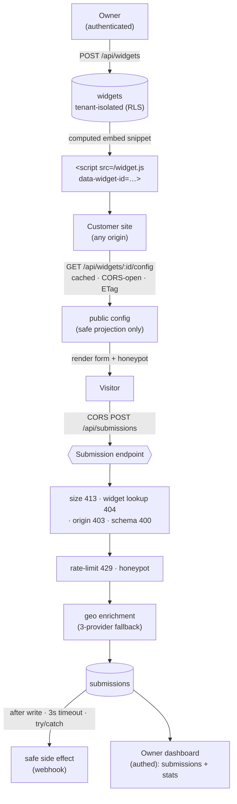

# Embeddable Widget Platform

Define a widget (popover / signup form / CTA), get a one-line `<script>` embed,
drop it on any external site, and watch submissions flow back — **enriched**
(geo), **spam-filtered** (honeypot), **rate-limited**, and **dashboarded**.

This is a *"the public internet is your input"* build: the submission endpoint is
hit by untrusted browsers on origins you don't control, so it defends at the
boundary — correct CORS (incl. preflight), validation, honest status codes, and
side effects that can never take the request down.

---

## Architecture



**Request ordering on `POST /api/submissions`** (fail fast, cheapest first):

1. **CORS preflight** (`OPTIONS`) → `204`, `Allow-Origin` **echoes** the request
   Origin (or `*`) — it can't be widget-scoped because preflight has no body.
2. **Size guard** → `413` before parsing anything.
3. **Widget lookup** → `404` if missing or not `active` (load-bearing: steps 4–5
   need the widget row).
4. **Origin check** → `403` if the widget's `allowed_origins` is set and the
   request Origin isn't in it (else allow-all).
5. **Validation** built from the widget's `fields_json` → `400`.
6. **Rate limit** → a hit is recorded on **every** attempt; over ~10/60s → `429`
   with `Retry-After`.
7. **Honeypot** → non-empty ⇒ silent `200` fake-success, stored `is_spam=true`,
   **geo + webhook skipped** (never tell the bot).
8. **Geo enrichment** → provider1 → provider2 → provider3 → `null`/`'none'`.
9. **Store** the submission (always).
10. **Safe webhook** → after the write, 3s timeout, `try/catch`; failures logged
    to `side_effect_failures` and swallowed. Never fails or blocks the response.
11. **Success** → `201` with the submission id.

---

## Tech stack

- **Next.js 14** (App Router, TypeScript)
- **Supabase** (Postgres + Auth) for tenant data + admin auth, with **RLS**
- **Zod** for input validation
- **Vitest** for tests
- **Postgres-backed sliding-window** rate limiting (no Redis dependency — see
  [Upgrade path](#not-built--upgrade-paths))

---

## Project layout

```
app/
  api/widgets/                 admin CRUD (authed, org-scoped)
  api/widgets/[id]/config/     public config (cached, CORS-open, ETag)
  api/widgets/[id]/submissions dashboard: paginated submissions (spam toggle)
  api/widgets/[id]/stats       dashboard: totals, spam, geo, last-24h
  api/submissions/             THE public submission endpoint (POST + OPTIONS)
  widget.js/                   vanilla embed loader (BASE injected server-side)
  dashboard/widgets/[id]/      simple dashboard page
lib/
  db.ts                        the single data-access seam (mocked in tests)
  cors.ts  validation.ts  rate-limit.ts  ip-hash.ts  webhook.ts  geo/providers.ts
supabase/migrations/           schema, RLS, seed
tests/                         cors · validation · rate-limit · geo-fallback
demo/customer-site.html        cross-origin host page
```

---

## Setup

```bash
npm install
cp .env.example .env        # fill in Supabase values if using a live project
```

### Run the tests (no database required)

The whole data layer sits behind `lib/db.ts`, which the tests mock — so the four
required suites run **offline, with no Supabase project and no credentials**:

```bash
npm test
```

### Run the app

```bash
npm run dev                 # http://localhost:3000
```

`/widget.js` and the submission boundary checks (`400`/`413`, CORS preflight)
work immediately. The DB-backed paths (widget lookup, origin allowlist, rate
limit, storage, dashboard) need a connected Supabase project (below).

### Connect Supabase (for the DB-backed paths + authed endpoints)

1. Create a Supabase project; put `SUPABASE_URL`, `SUPABASE_ANON_KEY`,
   `SUPABASE_SERVICE_ROLE_KEY` in `.env`.
2. Apply the migrations in `supabase/migrations/` (Supabase CLI `supabase db push`,
   or paste them into the SQL editor in order: `0001` → `0002` → `0003`).
3. To use the **authenticated** endpoints, create a user (Auth → Users) and link
   them to the seed org:
   ```sql
   insert into org_members (org_id, user_id)
   values ('00000000-0000-0000-0000-000000000001', '<YOUR-AUTH-USER-UUID>');
   ```
   Pass that user's access token as `Authorization: Bearer <token>` (the
   dashboard page has a field for it).

---

## Cross-origin demo

Serve the demo page from a **second origin** so it's genuinely cross-origin:

```bash
# terminal 1 — the platform
npm run dev                                  # http://localhost:3000

# terminal 2 — the "customer" site on a different port
npx serve demo -l 8080                       # http://localhost:8080/customer-site.html
#   (or: cd demo && python -m http.server 8080)
```

Open `http://localhost:8080/customer-site.html`. The one-line embed pulls
`widget.js` from `:3000`, fetches the config cross-origin, renders the form, and
POSTs submissions back to `:3000` — exercising the full CORS path.

---

## Attack this 🔓

With `npm run dev` on `:3000` (`W` = the seed widget id
`00000000-0000-0000-0000-0000000000a1`):

**Garbage JSON → `400`** *(works with no DB — short-circuits before lookup)*
```bash
curl -i -X POST http://localhost:3000/api/submissions \
  -H 'Content-Type: application/json' -d 'not-json'
```

**Oversized payload (>16 KB) → `413`** *(works with no DB)*
```bash
python -c "print('{\"widget_id\":\"00000000-0000-0000-0000-0000000000a1\",\"fields\":{\"email\":\"a@b.com\"},\"junk\":\"'+'x'*20000+'\"}')" \
| curl -i -X POST http://localhost:3000/api/submissions \
  -H 'Content-Type: application/json' --data-binary @-
```

**Cross-origin POST with a bad Origin → `403`** *(needs DB; set an allowlist first)*
```sql
-- restrict the seed widget so a foreign Origin is rejected
update widgets set allowed_origins = array['https://acme.example']
 where id = '00000000-0000-0000-0000-0000000000a1';
```
```bash
curl -i -X POST http://localhost:3000/api/submissions \
  -H 'Content-Type: application/json' -H 'Origin: https://evil.example' \
  -d '{"widget_id":"00000000-0000-0000-0000-0000000000a1","fields":{"email":"a@b.com"}}'
```

**Burst past the limit → `429` + `Retry-After`** *(needs DB)*
```bash
for i in $(seq 1 13); do
  curl -s -o /dev/null -w "%{http_code} " -X POST http://localhost:3000/api/submissions \
    -H 'Content-Type: application/json' \
    -d '{"widget_id":"00000000-0000-0000-0000-0000000000a1","fields":{"email":"a@b.com"}}'
done; echo
# => 201 201 201 201 201 201 201 201 201 201 429 429 429
```

**Geo provider outage → fallback** *(env flag; needs DB to see the stored value)*
```bash
GEO_PROVIDER_1_DOWN=true npm run dev
# submit once; the stored submission's geo_provider_used becomes 'provider2'
# (visible in the dashboard / submissions table). GEO_PROVIDER_2_DOWN too => provider3.
```

**Honeypot (spam) → silent `200`, no webhook**
```bash
curl -i -X POST http://localhost:3000/api/submissions \
  -H 'Content-Type: application/json' \
  -d '{"widget_id":"00000000-0000-0000-0000-0000000000a1","fields":{"email":"a@b.com"},"honeypot":"i-am-a-bot"}'
# => 200 {"ok":true,...} — looks like success; row stored with is_spam=true, webhook skipped.
```

---

## Definition of done

- [x] Admin CRUD for widgets, tenant-isolated, embed snippet generated
- [x] Config endpoint: cached, small payload, CORS-open, no sensitive fields leaked
- [x] Submission endpoint: correct CORS incl. preflight, boundary validation,
      honest status codes (`200`/`201`/`400`/`403`/`404`/`413`/`429`)
- [x] Geo enrichment with 3-provider fallback, degrades to `null` on total failure
- [x] Rate limiting per (ip, widget) + honeypot spam control, burst-verified
- [x] Webhook side effect never fails or blocks the submission response
- [x] All 4 required tests passing (`npm test`)
- [x] README + architecture diagram + working cross-origin demo page

---

## Not built / upgrade paths

Explicitly **out of scope** for this build (stretch goals, not implemented):

- **Redis rate limiting** — the limiter is Postgres-backed (sliding window over
  `rate_limit_hits`). Production upgrade: **Upstash Redis** for a distributed,
  lower-latency counter.
- Real minified/versioned **CDN bundle** for `widget.js` (currently served
  straight from a route handler; version tracked internally as `v1`).
- WebSocket/SSE **realtime dashboard**, **A/B targeting** rules, **GDPR**
  consent/export/delete flows, **CAPTCHA / proof-of-work**.

## Notes

- **Auth is real Supabase-only.** Authed endpoints (widget CRUD, dashboard) are
  built and unit-tested via the mocked data layer, but exercising them *for real*
  needs a Supabase project + a signed-in user linked in `org_members`.
- **IP privacy:** raw IPs are never stored — only a salted `sha256` (`IP_HASH_SALT`).
- **npm audit:** remaining advisories only resolve by force-upgrading to Next 15,
  which breaks the spec's Next 14 pin; Next is pinned at the latest 14.2.x patch.
```
