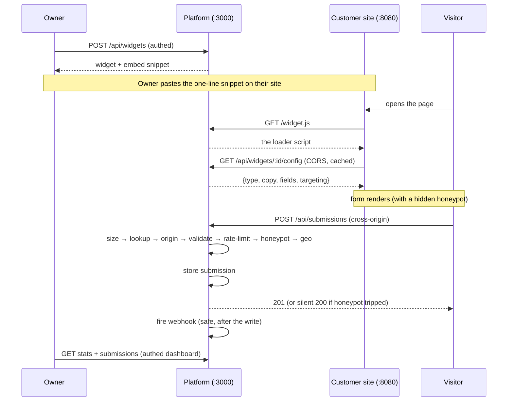

# How this works, and why — a walkthrough

This document explains the *reasoning* behind the Embeddable Widget Platform: the
problem it solves, how the pieces fit, and why each defense is shaped the way it
is. If the [README](../README.md) is "how to run it," this is "why it looks like
this." No prior context needed.

---

## 1. The one idea that shapes everything

A normal web app's API is called by **its own frontend**, running on **its own
origin**, by **users it authenticated**. You can trust the caller.

This platform inverts that. A customer drops a one-line `<script>` on *their*
website, and from then on the submission endpoint is called by:

- **browsers on origins you don't own and can't predict** (`acme.com`,
  `some-blog.net`, `localhost:8080`…),
- carrying **input from strangers** (real visitors, bored teenagers, and bots),
- at **whatever volume they feel like**.

> The public internet is your input.

Every hardening decision in this codebase falls out of that single sentence.
Three consequences in particular:

| Because the caller is… | …you must |
| --- | --- |
| a browser on a foreign origin | speak **CORS** correctly, including the preflight |
| an untrusted stranger | **validate everything** at the boundary, before doing work |
| possibly a bot or an abuser | **rate-limit**, **trap spam**, and **never crash on a bad request** |

---

## 2. Follow one lead through the system

Here's the whole lifecycle, from a customer setting up a widget to a lead landing
in the dashboard.



The important thing to notice: **three different endpoints, three different trust
postures.** That's not an accident — it's the core design.

---

## 3. Three endpoints, three trust levels

The system is deliberately split so that each surface has exactly the openness it
needs and no more.

### a) Admin API — *private* (`/api/widgets…`)
Authenticated, tenant-isolated. Only a logged-in owner can create or read their
org's widgets. Every query is scoped by the caller's `org_id`, so org A can never
see org B's data. This is the "normal, trusted" part of the app.

→ [app/api/widgets/route.ts](../app/api/widgets/route.ts),
  [lib/supabase/auth.ts](../lib/supabase/auth.ts)

### b) Config endpoint — *public but read-only and harmless* (`/api/widgets/:id/config`)
Any site needs to fetch a widget's shape to render it, so this is **CORS-open to
everyone** (`Access-Control-Allow-Origin: *`) and **cached** (`max-age=60` + an
`ETag`). Two deliberate choices:

- **It returns only a safe projection** — `{type, copy, fields, targeting}`. It
  *never* includes `webhook_url`, `allowed_origins`, or `org_id`. A public,
  cacheable document must assume the whole world can read it, so we make sure
  there's nothing sensitive in it. The safe projection is enforced at the data
  layer in `getPublicConfig`, which only *selects* the safe columns — sensitive
  fields never even leave the database.
- **`*` is correct here precisely because it's cacheable.** A cached response is
  shared across all origins, so the allow-origin header can't depend on who's
  asking. (Contrast this with the submission endpoint below.)

→ [app/api/widgets/[id]/config/route.ts](../app/api/widgets/[id]/config/route.ts)

### c) Submission endpoint — *public and hostile* (`/api/submissions`)
This is where strangers write data. It gets the full gauntlet (next section).

→ [app/api/submissions/route.ts](../app/api/submissions/route.ts)

---

## 4. The submission gauntlet — the heart of the build

A single POST runs through a fixed sequence of checks. The **order is the design**:
each step is placed to fail as cheaply and as early as possible, and each depends
on the ones before it.

```
OPTIONS preflight ─▶ 204 (permissive, echoes Origin)

POST:
  1. size guard ........... 413  (before we parse a single byte)
  2. parse + widget_id .... 400
  3. widget lookup ........ 404  (missing OR not 'active')   ← load-bearing
  4. origin check ......... 403  (per-widget allowlist)
  5. field validation ..... 400  (schema built from the widget)
  6. rate limit ........... 429 + Retry-After
  7. honeypot ............. 200  (silent fake success)
  8. geo enrichment ....... (skipped if spam)
  9. store ................ (always)
 10. webhook ............. (safe side effect)
 11. success ............. 201
```

Why it's ordered this way, step by step:

**Preflight can't know the widget — so it has to be permissive.**
A CORS preflight is an `OPTIONS` request with **no body**. The `widget_id` lives
*in* the POST body, so at preflight time we literally don't know which widget is
being targeted, and therefore can't apply its per-widget origin allowlist. The
preflight simply **echoes back the caller's `Origin`** (or `*`) and says "POST is
allowed." The *real* origin enforcement is deferred to step 4, after the body is
parsed and we know the widget. This is the single most counter-intuitive part of
the whole build, and getting it wrong (hardcoding one origin in the preflight)
would silently break the widget for every customer except one.

→ [lib/cors.ts](../lib/cors.ts)

**Cheap checks come before expensive ones.**
The size guard (step 1) rejects an oversized body *before parsing JSON* — you
don't want to allocate megabytes of objects for a payload you're going to throw
away. Validation (step 5) runs *before* geo enrichment and DB writes (steps 8–9) —
no point enriching or storing a payload that's malformed.

**The widget lookup is "load-bearing."**
Because `/api/submissions` is a *flat* route (not nested under `/widgets/:id/`),
the only way to know which widget this is, is to read `widget_id` out of the body.
Steps 4 and 5 both *need* the widget row — its `allowed_origins` (to check the
origin) and its `fields_json` (to build the validation schema). So the lookup
must happen between the size guard and those checks. It also enforces
`status === 'active'`: a paused or archived widget rejects submissions with a 404.

**Rate limiting records every attempt, then counts.**
On each attempt we insert a hit row *first*, then count hits in the trailing 60s
window (the count includes the one we just inserted). Over ~10/min → `429` with a
`Retry-After` header. Recording even rejected attempts means a sustained flood
keeps its own window saturated and stays blocked, rather than getting a fresh
allowance each time.

→ [lib/rate-limit.ts](../lib/rate-limit.ts)

**The honeypot must lie convincingly.**
A hidden form field (`honeypot`) is invisible to humans but bots fill it in. If
it's non-empty, we do something subtle: we **return a normal-looking success**,
store the row with `is_spam=true`, and **skip the webhook**. The one thing we must
never do is tell the bot it was caught — otherwise the bot author adjusts and
tries again. From the outside, a trapped spam submission is indistinguishable from
a real one. We also **skip geo enrichment** for spam: no reason to spend the
fallback-chain latency on a row we're going to discard, and it keeps the fake
success fast (so even the *timing* looks normal).

**Geo enrichment degrades instead of failing.**
Enrichment tries three providers in order — `provider1 → provider2 → provider3` —
and if all three throw, it stores `geo_json: null` with `geo_provider_used: 'none'`.
Enrichment is a *nice-to-have*; it must never block or fail a submission. The
`GEO_PROVIDER_1_DOWN` / `GEO_PROVIDER_2_DOWN` env flags force a provider to throw,
which is how the fallback is tested deterministically.

→ [lib/geo/providers.ts](../lib/geo/providers.ts)

**The webhook is a "safe side effect."**
If the widget has a `webhook_url`, we POST the submission to it *after* the DB
write, wrapped in a `try/catch` with a 3-second timeout. This is the pattern worth
internalizing: **a side effect must never be able to fail or delay the thing it's a
side effect of.** The visitor's submission is already safely stored; whether the
customer's webhook is up, slow, or returning 500 is *their* problem, logged to
`side_effect_failures` and swallowed. The response returns `201` regardless.

→ [lib/webhook.ts](../lib/webhook.ts)

**Status codes are honest.**
`200` (spam, faked), `201` (created), `400` (malformed), `403` (bad origin),
`404` (no such / inactive widget), `413` (too big), `429` (too fast). A caller can
tell exactly what happened — except for the one case where lying is the point.

---

## 5. Cross-cutting design decisions

### One data-access seam (`lib/db.ts`)
Every single database call in the app goes through one file. Nothing else imports
the Supabase client directly. This does three jobs at once:

1. **Testability / offline-friendliness.** The tests `vi.mock('@/lib/db')` and
   feed canned rows, so the entire request path — CORS, validation, rate limiting,
   honeypot, geo, status codes — runs with **no database, no Supabase project, and
   no credentials**. That's *why* `npm test` works on a fresh clone.
2. **Tenant isolation in one place.** Admin/dashboard functions take an `orgId`
   and filter on it explicitly, so cross-tenant leakage would have to be a bug in
   one small, auditable file.
3. **A leak-proof public projection.** `getPublicConfig` selects only the safe
   columns, so the config endpoint *can't* accidentally leak a secret.

→ [lib/db.ts](../lib/db.ts)

### Two Supabase clients: defense in depth
- The **anon client** (`lib/supabase/server.ts`) carries the user's token and is
  subject to **Row-Level Security** — Postgres itself refuses cross-tenant reads.
- The **service-role client** bypasses RLS and is used only on the trusted server
  path (the public submission write). It's never exposed to a browser.

Tenant isolation is therefore enforced *twice*: once by explicit `org_id` filters
in `lib/db.ts`, and once by RLS in the database. Either alone would do; both
together means a single mistake doesn't become a breach.

→ [supabase/migrations/0002_rls.sql](../supabase/migrations/0002_rls.sql)

### IPs are hashed, never stored raw
Rate limiting and abuse detection need to recognize a repeat caller, but they
don't need the actual IP. So we store a salted `sha256(IP_HASH_SALT + ip)` and
never the raw address — you get the abuse-prevention value without holding
personal data you'd rather not.

→ [lib/ip-hash.ts](../lib/ip-hash.ts)

### Postgres-backed rate limiting (not Redis)
The limiter is a sliding window over a `rate_limit_hits` table. This keeps the
whole system to a **single dependency** (Postgres) with no Redis to run. The
tradeoff is honest: at very high volume a Postgres counter is slower than a Redis
one, so the README names **Upstash Redis** as the drop-in production upgrade. For
a build whose point is *correctness of the boundary*, one datastore is the right
call.

---

## 6. The threat model, concretely

What each defense actually stops:

| An attacker tries… | The defense | The result |
| --- | --- | --- |
| POST from a site not on the allowlist | per-widget origin check (step 4) | `403` |
| Flood the endpoint with requests | sliding-window rate limit (step 6) | `429 + Retry-After` |
| Send a huge body to exhaust memory | size guard *before* parse (step 1) | `413` |
| Send garbage / wrong-shaped fields | zod schema from `fields_json` (step 5) | `400` |
| Auto-submit with a bot | hidden honeypot (step 7) | silent `200`, quarantined |
| Take the endpoint down via a bad webhook | webhook is an isolated side effect | submission still `201` |
| Read another tenant's submissions | `org_id` scoping + RLS | nothing leaks |
| Harvest secrets from the public config | safe projection at the data layer | secrets never served |
| Break the widget for everyone by pinning CORS | preflight echoes Origin | every origin still works |

---

## 7. Why the tests look the way they do

The four suites map one-to-one onto the definition of done, and each **drives the
real handler** with only the database mocked — so they test *actual behavior*, not
a reimplementation.

- **`cors.test.ts`** calls the real `OPTIONS` handler and asserts the preflight
  echoes the Origin and advertises `POST, OPTIONS` / `Content-Type`. Proves the
  CORS contract browsers depend on.
- **`validation.test.ts`** posts malformed JSON, a schema-invalid payload, and a
  20 KB body, expecting `400 / 400 / 413` — plus one *valid* payload expecting
  `201`, so a bug that returns 400 for everything can't sneak a green suite past.
- **`rate-limit.test.ts`** actually bursts the endpoint `RATE_LIMIT_MAX + 3` times
  against a stateful mock and asserts the first N are `201` and the rest are `429`
  with `Retry-After`. It exercises the real insert-then-count logic.
- **`geo-fallback.test.ts`** flips the `GEO_PROVIDER_*_DOWN` flags and checks the
  chain lands on provider2, then provider3, then `null` — i.e. graceful
  degradation, not a thrown error.

→ [tests/](../tests/)

---

## 8. What's intentionally *not* here

So the boundaries are clear: no minified CDN bundle, no realtime dashboard, no A/B
targeting, no GDPR export/delete flows, no CAPTCHA. These are real production
concerns, but they're orthogonal to this build's thesis — *hardening a public
submission endpoint* — and were left out on purpose. The README lists them under
upgrade paths.

The one thing to know before running the DB-backed paths for real: the
authenticated endpoints and live submission storage need a connected Supabase
project (setup is in the README). The offline story — the app boundary, the
`/widget.js` loader, and all four test suites — needs nothing but `npm install`.
